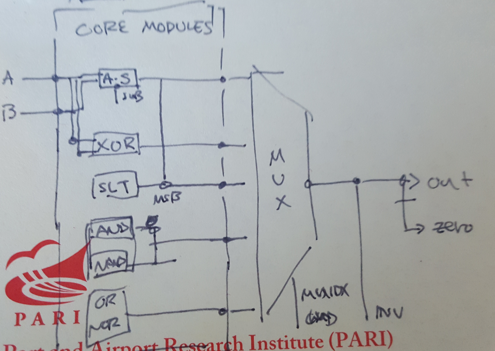

## Work Plan

### High-Level Diagram:

### Implementations

Total : 7 Hr. 20 min.

* **ALU Implementation: 3 Hr. 20 min.**   _By Oct. 4th_
	
  -High-Level Design : 1 Hr.
   How the modules connect, emit flags, etc.
  
  -Gate Delay : 20 min.
   Deciding how long each of the gates will take to execute.
	
  -Modules : 2 Hr.
   10 min. per Module * 8 Modules :  80 min.
   Debugging Buffer : 40 min.

* **Test Benches : 3 Hr.**                _By Oct. 4th_
  
  -Implementation : 1 Hr.
   
  -Test Cases : 126 min.
   3 min. per test Case * 4 Test Cases per Each Module * 8 Modules = 96 min.
   Debugging Buffer : 30 min.

* **Analysis : 1 Hr.**                    _By Oct. 5th_
  
  -Worst Propagation Delay Calculation : 30 min.
		
  -Worst Propagation Delay Simulation and Identification : 30 min.
  
* **Report : 1 Hr.**                      _By Oct. 5th_
